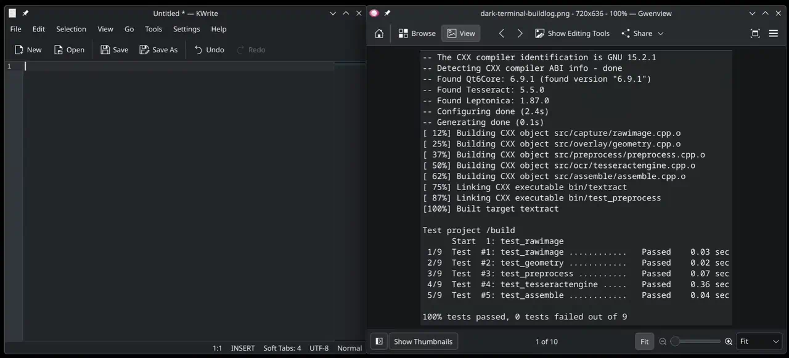

# textract

Grab any text you can see. Press a key, drag a box around it, paste.

No account, no upload, no internet — it all happens on your machine.



## Will this work on my system?

**Yes, if you run KDE Plasma 6 on Wayland.**

Built and tested on Arch (CachyOS) with Plasma 6.7.3 and KWin 6.7.3. Other
distributions should work but are not tested.

**No, if you run** X11, GNOME or another desktop, Windows, or macOS. Screen
capture here talks to KWin directly and there is no portal fallback yet.

Not sure? Run this — if it prints `wayland`, you are good:

```bash
echo $XDG_SESSION_TYPE
```

## Install

```bash
git clone https://github.com/gzrx/text-extractor.git
cd text-extractor/packaging
makepkg -si
```

`makepkg` pulls in everything it needs, so there is no dependency list to work
through by hand.

Then start it, and have it start with you from now on:

```bash
systemctl --user enable --now textract
```

That is it. Press **Meta+X** and drag a box around some text.

<details>
<summary>If a capture fails right after installing</summary>

Run `kbuildsycoca6` once. KDE looks up applications through a per-user cache
that a system-wide install cannot refresh for you. This is usually not needed —
the cache normally notices on its own.

If anything else goes wrong, the daemon logs to the journal rather than to a
notification:

```bash
journalctl --user -u textract
```
</details>

## First run

Press **Meta+X**. The screen dims, you drag a rectangle, and the text inside it
is on your clipboard when you let go.

Two things worth knowing on day one:

- **Hold Shift while you drag** to get the text exactly as it appeared, with no
  reformatting. Useful when the automatic formatting guesses wrong.
- **Press Meta+Shift+X** to re-read the *same selection* with a slower, more
  careful engine. No need to drag again. See [Two engines](#two-engines).

### Changing the shortcut

**System Settings → Keyboard → Shortcuts → textract.**

The defaults avoid keys Plasma already uses. If Meta+X clashes with something
you have set up, change it there — the daemon picks it up immediately, and your
choice survives updates.

## What it does that plain OCR doesn't

Most text extraction hands you one flat blob of words. This tries to give you
back what you actually selected.

- **Code stays code.** Indentation is preserved, and nothing is autocorrected.
- **Multi-column layouts come back as paragraphs.** Lines that only wrapped
  because a column was narrow are rejoined, instead of arriving as ragged
  fragments.
- **Tables come back as columns.** Grab a table or a spreadsheet region and
  paste it straight into a spreadsheet.
- **Two engines, one key apart.** A fast one by default; a slower, more accurate
  one on a second key when the first gets it wrong.
- **It runs entirely on your machine.** No account, no upload, no telemetry. The
  only time it touches the network at all is the optional one-time download of
  the second engine's models.
- **The accuracy claims are measured.** Every number in this README comes from a
  fixed set of test images committed to the repository, not from an impression.

## Configure

```bash
textract --configure
```

Opens a small dialog for the languages you want recognised and where the second
engine's models live. Settings are saved to `~/.config/textractrc` and a running
daemon picks up changes immediately — no restart.

Two settings live in that file but not in the dialog: `Upscale` and
`Binarize`. Both are readable and writable by hand in
`~/.config/textractrc`; their defaults are the values measured against
the project's fixture corpus, and they are left out of the dialog on
purpose, as an escape hatch for content the corpus doesn't cover rather
than a knob meant for everyday tuning.

### Languages

English works out of the box. For anything else, install its data and then pick
it in the dialog:

```bash
sudo pacman -S tesseract-data-msa       # Bahasa Melayu
sudo pacman -S tesseract-data-chi_sim   # Simplified Chinese
sudo pacman -S tesseract-data-ara       # Arabic
```

Any `tesseract-data-*` package works. You can enable several at once.

### Two engines

**Meta+Shift+X** re-reads your last selection with PP-OCRv6 (the app itself
calls this "tier 2", in notifications and `--help`) — no re-drag — and tells
you whether the result changed. Download its models once:

```bash
textract --fetch-models     # about 31 MB, checksum-verified
```

It is an escalation rather than a replacement, because neither engine wins
everywhere. The second one is clearly better on Chinese/Japanese/Korean text and
on source code; the default is still better on small terminal text. The second
engine also needs no language setting — it carries one fixed character set
covering 18,708 characters.

## Updating

**Always restart the service after updating**, whichever way you update:

```bash
systemctl --user restart textract
```

An update replaces the program file underneath the running daemon, and KDE can
refuse it screen access until it restarts. The package prints this reminder on
upgrade; if you miss it, captures can fail with an authorisation error until
you do.

**If you installed by cloning:**

```bash
cd text-extractor && git pull
cd packaging && makepkg -si
systemctl --user restart textract
```

**If you use an AUR helper:** this is a `-git` package, and helpers do **not**
rebuild those during a normal upgrade. You need to ask for it:

```bash
yay -Syu --devel
```

Without `--devel` you will sit on the version you first installed indefinitely,
with no indication anything newer exists.

**Your shortcut will not change.** If you had already bound your own keys — or
were using the old Calculator-key default — an update leaves them exactly as
they are. To move to the current defaults, clear the old binding and restart:

```bash
kwriteconfig6 --file kglobalshortcutsrc --group textract --key extract_text --delete
kwriteconfig6 --file kglobalshortcutsrc --group textract --key extract_text_tier2 --delete
systemctl --user restart textract
```

## Known limitations

Stated plainly so you can decide whether any of them matter to you.

- **One monitor.** The coordinate maths assumes a single display scale. With two
  monitors at different scaling factors, selections will land in the wrong place.
- **Wayland on KWin only.** No X11, and no `xdg-desktop-portal` fallback.
- **Small terminal text is the accuracy floor** for both engines — roughly 7pt
  monospace is where recognition starts to slip.
- **Single-column prose keeps its on-screen line breaks.** Paragraph rejoining
  currently only triggers on multi-column layouts.
- **The second engine mis-reads some layouts** that the default handles fine:
  two-column PDFs and some right-aligned spreadsheet columns.
- **Only Arch is tested.** Nothing should be distribution-specific beyond the
  packaging, but nobody has checked.
- **Installing to your home directory needs one extra step** — see
  [Installing to a home prefix](#installing-to-a-home-prefix).

## Built on

This is a thin layer over other people's hard work.

- **[PaddleOCR](https://github.com/PaddlePaddle/PaddleOCR)** — the PP-OCRv6
  models behind the second engine (Apache-2.0). Its accuracy on CJK text and
  source code is entirely their achievement; this project only supplies the
  plumbing around it.
- **[Tesseract](https://github.com/tesseract-ocr/tesseract)** — the default
  engine, and the reason the tool is useful the moment it is installed.
- **[Leptonica](http://www.leptonica.org/)** — the image handling underneath it.
- **[ONNX Runtime](https://onnxruntime.ai/)** — runs the PaddleOCR models
  without needing a PaddlePaddle installation.
- **[Hunspell](https://hunspell.github.io/)** — decides whether a hyphen at the
  end of a line was part of the word or just typesetting.
- **[KDE](https://kde.org/)** — KWin's screenshot interface, KGlobalAccel,
  KConfig, KNotifications, the clipboard, and Extra CMake Modules.
- **[LayerShellQt](https://invent.kde.org/plasma/layer-shell-qt)** — the
  selection overlay.
- **[Qt](https://www.qt.io/)** — everything else.

---

*Everything below is for people who want to build, modify, or contribute.*

## Building from source

```bash
sudo pacman -S --needed cmake extra-cmake-modules qt6-base layer-shell-qt \
                        tesseract tesseract-data-eng leptonica \
                        hunspell hunspell-en_us onnxruntime \
                        kglobalaccel kguiaddons kconfig knotifications \
                        ki18n kwindowsystem
cmake -B build -DCMAKE_BUILD_TYPE=Release
cmake --build build -j$(nproc)
ctest --test-dir build --output-on-failure
```

`onnxruntime` is the CPU build and is required to link. The CUDA stack was
measured and rejected: roughly 6 GiB against 25 MiB, for no gain at this model
size.

`hunspell` is needed to build; its dictionaries are not. The dictionary is
consulted for exactly one decision and disables itself quietly when it finds no
`en_US.{aff,dic}`, so a machine without `hunspell-en_us` still extracts text.

### Installing to a home prefix

`cmake --install` puts the systemd unit under
`${CMAKE_INSTALL_LIBDIR}/systemd/user`. With `-DCMAKE_INSTALL_PREFIX=$HOME/.local`
that is `~/.local/lib/systemd/user`, which **systemd does not search**. Link it
into a directory that is:

```bash
mkdir -p ~/.local/share/systemd/user
ln -sf ~/.local/lib/systemd/user/textract.service ~/.local/share/systemd/user/
systemctl --user daemon-reload
```

### Running from the build tree

KWin authorises screen capture by matching the running executable against an
installed desktop entry, so an uninstalled binary needs its own:

```bash
cp build/org.kde.textract.dev.desktop ~/.local/share/applications/
kbuildsycoca6
```

CMake generates that file with an absolute path to your build output.

### Diagnostics

```bash
textract --capture-test /tmp/shot.png   # capture only; verifies authorisation
textract --select-test  /tmp/crop.png   # capture + drag; writes the crop
```

### A note on `makepkg -si`

`source=` is a `git+https://` URL, so it clones and builds the **pushed
remote**, not your working tree. Uncommitted local edits will not be in the
package; build with `cmake` directly to test those.

## How it works

The daemon captures the **entire workspace up front**, then lets you drag a
rectangle out of an image already in RAM. No latency between mouse-up and OCR,
one D-Bus round trip instead of two, and no live transparent overlay over the
real desktop — which Wayland makes awkward.

```
src/
├── capture/     KWin ScreenShot2 D-Bus client
├── overlay/     LayerShellQt region selector
├── preprocess/  polarity, upscale, grayscale
├── ocr/         OcrEngine interface, Tesseract and PP-OCRv6 implementations
├── models/      tier-2 manifest, checksummed download, atomic install
├── analyze/     what kind of region is this
├── order/       reading order for engines that supply none
├── assemble/    words → text, one branch per kind
├── correct/     Hunspell dictionary, for the hyphen decision
├── config/      settings, and the dialog behind --configure
├── clipboard/   KSystemClipboard wrapper
└── app/         daemon, global shortcuts, notifications
```

Anything that can be a pure function is one. `capture/`, `overlay/`, the config
dialog and the daemon controller need a live compositor or live engines and are
verified by hand; the rest is pure data transformation with real unit tests,
which is what makes accuracy work iterable.

The whole pipeline between capture and clipboard lives behind one function, so
the daemon and the fixture harness run byte-for-byte the same path. A harness
that scored a different path would measure nothing.

The daemon is resident rather than fire-and-exit for two reasons: Tesseract's
`Init()` costs ~240ms and would otherwise be paid on every capture, and on
Wayland **clipboard contents die with the client that set them** — a one-shot
tool would copy text that vanishes the moment it exits.

## Gotchas worth knowing

Things that cost real debugging time here, documented in case they save someone
else the same afternoon.

**KWin screenshot authorisation needs three things, not one.** Missing any one
gives `NoAuthorized`:

1. `X-KDE-DBUS-Restricted-Interfaces=org.kde.KWin.ScreenShot2` — case-sensitive.
   The lowercase `org.kde.kwin.screenshot` in older forum posts is the legacy v1
   interface and does not authorise v2.
2. `Exec=` must be an **absolute** path matching the running binary exactly.
3. The entry must be in ksycoca. `update-desktop-database` does not touch it.
   A package install is normally picked up on its own; a hand-copied entry may
   need `kbuildsycoca6`.

KWin caches the grant per executable path, so a binary that once worked keeps
working after you delete its desktop file. Test negative cases with a copy at a
fresh path. Relatedly, **replacing the binary invalidates a running daemon's
grant** — `/proc/<pid>/exe` gains a `(deleted)` suffix and matches nothing.
Restart, don't debug the desktop file.

**`QScreen::devicePixelRatio()` lies under fractional scaling.** On a 1.25-scaled
display it reports `2` — the integer buffer scale. The true ratio is on
`QWindow::devicePixelRatio()`. Using the screen's value silently doubles every
coordinate.

**`asyncCall()` doesn't send anything without a running event loop**, and
`QDBusUnixFileDescriptor` *duplicates* the fd you hand it, so your own process
keeps a write end of the pipe open and `read()` never sees EOF. Draining a
capture pipe by waiting for EOF deadlocks twice over. Track the expected byte
count (`stride × height`) instead.

**`LayerShellQt::Shell::useLayerShell()` must run before any window exists.** It
swaps the Wayland shell integration; windows created earlier get an ordinary
surface type.

**`KConfigWatcher` only fires for writes flagged `KConfigBase::Notify`.** A
plain `writeEntry()` followed by `sync()` updates the file correctly and emits
no `configChanged()` at all — indistinguishable from a watcher that was never
connected. When testing live reload by hand, `kwriteconfig6` needs `--notify`.

**Global shortcuts are persisted by KGlobalAccel.** Once a binding is stored in
`kglobalshortcutsrc`, changing the `QKeySequence` in code appears to do nothing,
because `setShortcut` is deliberately called without `NoAutoloading` so a user's
own choice wins. Clear the stored key to see a code change take effect — but
deleting the file entry alone is not always enough while the daemon is still
registered: `kded6`'s running `kglobalaccel` keeps its own live registry and can
rewrite the old binding straight back. Stop the daemon first, or unregister the
binding explicitly:

```bash
qdbus6 org.kde.kglobalaccel /kglobalaccel org.kde.KGlobalAccel.unregister "textract" "extract_text"
```

## Contributing

Contributions are welcome, including small ones — a distribution that is not
Arch, a desktop that is not Plasma, a fixture that breaks something.

Unit-testable code is written test-first. `capture/`, `overlay/`, the config
dialog and the daemon controller are the exceptions — they need a live
compositor or live engines, and are covered by `--capture-test`, `--select-test`
and manual checks.

Accuracy changes are held to the test corpus rather than to judgement. A change
that moves no score has not earned its place, and lowering a fixture's floor to
get a green run is how a regression net rots — if a floor looks wrong, read the
diff instead.

```bash
ctest --test-dir build --output-on-failure
```

## Roadmap

| | Milestone | Status |
|---|---|---|
| M0 | ScreenShot2 capture | done |
| M1 | Layer-shell region selection, DPI-correct | done |
| M2 | Tesseract → clipboard, raw mode | done |
| M3 | Preprocessing + fixture test corpus | done |
| M4 | Layout classification; code/prose/table modes | done |
| M5 | Prose post-correction (dictionary hyphen check) | done |
| M6 | Second engine: PP-OCRv6 via ONNX Runtime, CPU | done |
| M7a | Settings, config dialog, live reload | done |
| M7b | Packaging, systemd unit, install paths | done |
| M8 | README rewrite, new default shortcuts, post-upgrade restart notice | done |

Not yet done, and not currently scheduled: publishing to the AUR, multi-monitor
support, and an `xdg-desktop-portal` fallback for non-KWin compositors.

Two entries differ from what earlier versions of this file promised, and the
reasons are worth stating. **M5 shipped half of what it planned**: a
confusion-set corrector was built, measured against the corpus, found to fire
zero times on real data, and deleted. The dictionary hyphen check survived
because it moves a score. **M6 is CPU, not GPU, and PP-OCRv6 rather than v5** —
the CUDA dependency was measured at ~6 GiB for no gain at this model size, and
v6 superseded v5 in June 2026.

Preprocessing does **not** binarise by default. Otsu thresholding costs 0.0054
on the corpus at the default 3× upscale, which is why it is off — but it *helps*
by 0.0022 at 2×. So it is "not helpful at the default", not "harmful on screen
text in general". Upscaling and polarity detection are where the wins are.

## License

GPL-3.0-or-later. See [LICENSE](LICENSE).
